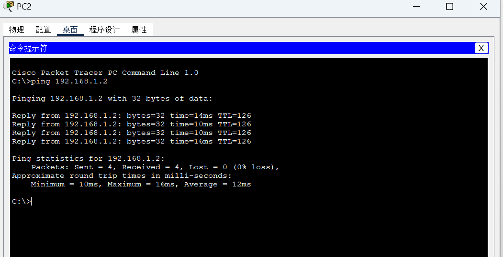
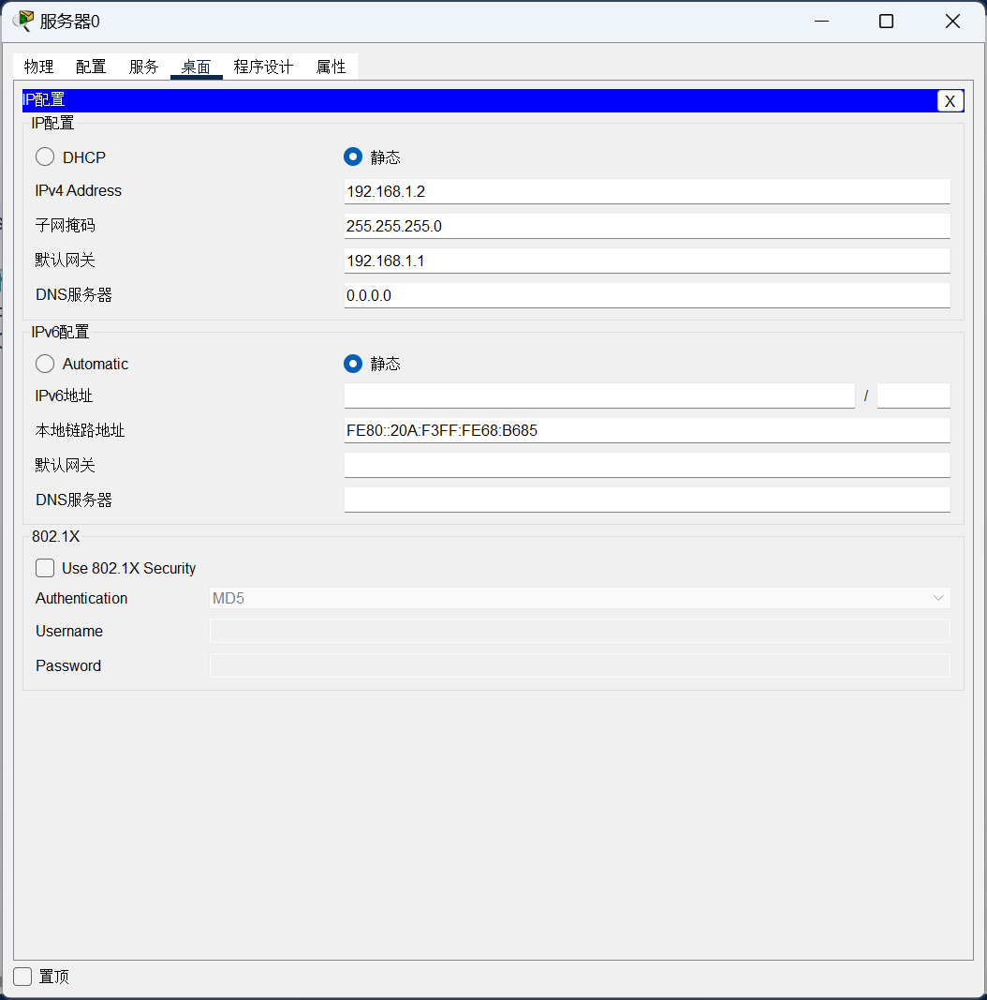
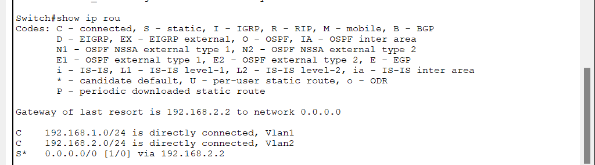

# CiscoPackerTracer实验记录

## 实验一：交换机的Telnet远程登录和配置

**实验工具:Cisco Packet Tracer**

**实验目的:模拟实现交换机的Telnet远程登录和配置**

**实验过程:**

1、搭建拓扑图：交换机2960   PC机   


2、实验背景：交换机和PC机要在同一网段

3、实验过程：

```
# 交换机开启后，PC打开Terminal输入下述命令
en										# 进入特权模式  用户在该模式下可以查看并修改Cisco设备的配置
conf t                                	   # 进入全局配置模式 用户在该模式下可修改交换机的全局配置。如修改主机名
interface vlan 1                           # 进入接口模式，针对某个接口进行配置 这里是配置虚拟局限网vlan接口1
ip address 192.168.1.1 255.255.255.0       # 设置交换机的IP地址
no shutdown                                # 开启交换机
exit                                       # 返回上一级
enable password 123456                     # 设置登录特权模式的密码
line vty 0 4                               # 进入line配置模式 对虚拟终端（vty）和控制台端口进行配置 vty 0-4线路
password 5ijfj                             # 设置虚拟终端和控制台的用户级登录密码
login                                      # 让设置的密码生效
end
show running                               # 查看配置
```

接着设置PC的IP地址，要与交换机在同一网关


设置好IP之后，打开终端尝试ping 交换机的IP，看看能否ping通


实验成功

## 实验二：交换机划分VLAN配置

**实验工具:Cisco Packet Tracer**

**实验目的:交换机划分VLAN配置**

**实验过程:**

1、什么是VLAN？什么是Port VLAN？什么是Tag VLAN

​		VLAN是指在一个物理网段内，进行逻辑的划分，划分成若干个虚拟局域网。VLAN可以进行灵活的划分。相同的VLAN内的主机可以相互直接通信，不同的VLAN间的主机之间互相访问必须经由路由设备进行转发。广播数据包只可以在本VLAN内进行广播，不能传输到其他的VLAN中。

​		Port VLAN是实现VLAN的方式之一，它利用交换机的端口进行VLAN的划分，一个端口只能属于一个VLAN。

​		Tag VLAN是基于交换机端口的另外一种类型，主要用于使交换机的相同的VLAN内的主机之间可以直接访问，同时对于不同VLAN的主机进行隔离。

2、在CPT中搭建拓扑图


3、设置PC0-PC3的IP

​		分别为192.168.1.2/3/4/5 

​		默认网关均为192.168.1.1

4、配置交换机

```
en
conf t
vlan 2						#划分VLAN2
exit 
vlan 3						#划分VLAN3
exit
interface fa 0/1		 	 #配置0/1端口
switchport access vlan 2      #vlan2与access接口相连  access接口一般用于和不能识别Tag的用户终端（如用户主机、服务器等）相连
exit
interface fa 0/2			 #配置0/2端口
switchport access vlan 3      #vlan3也与access接口相连
exit
interface fa 0/24             #配置0/24端口
switchport mode trunk         #与Trunk接口相连 Trunk接口一般用于连接交换机、路由器、AP以及可同时收发Tagged帧和Untagged帧的语音终端
end
show vlan                      #查看配置
```

交换机0


交换机1


5、PING

​		PC0尝试ping PC1 和 PC3 的IP，结果如下

​		显然ping pc1 不通，但是pc3能通，因为都在vlan2网段下


​	根据这个实验结果，猜测PC1能ping通PC3，ping不通PC3


猜测正确，实验成功


**实验总结**

​	同一VLAN下的用户可以互相通信，就像在同一个局域网下，且不会广播到其他的VLAN中去。若没有路由，不同的两个VLAN不能够互相通信

## 实验三：利用三层交换机实现VLAN间路由

**实验工具:Cisco Packet Tracer**

**实验目的:利用三层交换机实现VLAN间路由，即实现不同VLAN下的PC机的通信**

**实验过程:**

1、搭建拓扑图：一台两层交换机、一台多层交换机、三台PC


2、设置PC机IP

​		PC1=>192.168.1.2      PC2=>192.168.2.2   pc3=>192.168.1.3

​		192.168.1.X的默认网关:192.168.1.1

​		192.168.2.2的默认网关:192.168.2.1

​	3、配置交换机

​	二层交换机

​		划分vlan 2和vlan 3，0/2=> vlan 2    0/3=>vlan 3  0/1=>trunk模式

​		show vlan配置情况如下：


多层交换机

​	设置三层交换机 VLAN 间的通信，创建 VLAN2,VLAN3 的虚接口，并配置
	虚接口 VLAN2、VLAN3 的 IP 地址。

​	分出vlan2 和 vlan3  0/1端口设置为trunk模式

​	interface vlan 2 (进入vlan 2配置) 配置vlan 2的IP地址(PC1和PC3的默认网关) no shutdown开启

​	int  vlan3(进入vlan3配置)配置vlan3的IP地址(PC2的默认网关) no shutdown开启

​	end后查看路由表 show ip rou

​	

```
en
conf t
vlan 2
exit
vlan 3
exit
int fa 0/1
switchport trunk encapsulation dot1q #将0/1端口封装成dot1q协议
switchport mode trunk
exit
int fa 0/2
switchport access vlan 2
exit
interface vlan 2
ip address 192.168.1.1 255.255.255.0
no shutdown
exit
interface vlan 3
ip address 192.168.2.1 255.255.255.0
no shutdown
exit
ip routing
exit
show ip route
show vlan
```


PC3尝试ping PC1和PC2

都能ping通，实验成功。


​	

**实验总结**

​	1、如果没有封装协议，在将0/1端口设置为trunk模式时就会报错，因为要先封装后设置

​	2、最开始在show ip route时报错表示没有设置默认网关，猜测应该是没有将0/2端口设置成access接口模式，即缺少命令  `int fa 0/2      switchport access vlan 2`，或者是没有ip routing来启动路由转发协议

​	3、VLAN间要实现通信需要利用交换机来实现。

​	4、三层交换机具备网络层的功能，实现VLAN互相访问的原理是：利用三层交换机的路由功能，通过识别数据包的IP地址，查找路由表进行选路准发。三层交互机利用直连路由可以实现不同VLAN之间的互相访问。三层交换机给接口配置IP地址，采用SVI(交换虚拟接口)的方式实现VLAN间互连。SVI是指为交换机中的VLAN创建虚拟接口，并且配置IP地址。

## 实验四：快速生成树配置

**实验工具:Cisco Packet Tracer**

**实验目的:配置快速生成树，使某一端口关闭后，能够快速使用备用端口进行通信**

**实验过程:**

1、搭建拓扑图，配置PC机的IP地址

​	

2、配置交换机

```
en
conf t
vlan 3                        	 	添加交换机的虚拟端口 vlan 3
exit
int f0/3                        	进入端口 f0/3
switchport access vlan 3        	将 f0/3 端口绑定到VLAN 3
end
conf t
int range f0/1-2               		同时选择端口 f0/1 f0/2
switchport mode trunk          		设置端口模式为 trunk 
exit
spanning-tree mode rapid-pvst		指定生成树协议的类型为 RSTP
end

conf t 
int f0/1
shutdown						   关闭0/1端口
```

3、验证PC机通信结果

配置完成后打开PC1的终端ping -t 192.168.1.3

然后打开交换机1的CLI关闭0/1端口，观察PC1终端，如下图：


显然没有中断，此时拓扑图显示如下，证明0/1端口确实已经关闭，但是仍然可以ping通


说明此时采用了备用链路0/2

4、查看交换机spanning-tree状态，了解根交换机和根端口情况


> 使用GPT进行分析如下，便于学习：
>
> ### VLAN0001
>
> - **根桥信息：**
>   - **优先级：** 32769
>   - **地址：** 000B.BE4D.0592
>   - **成本：** 19
>   - **端口：** FastEthernet0/1
> - **桥接信息：**
>   - **优先级：** 32769（来自32768 + sys-id-ext 1）
>   - **地址：** 00D0.BC45.C89A
>   - **Hello时间：** 2秒
>   - **最大年龄：** 20秒
>   - **转发延迟：** 15秒
>   - **老化时间：** 20秒
>
> - **接口角色和状态：**
>   - **Fa0/2：** 
>     - **角色：** 备用
>     - **状态：** 阻塞
>     - **成本：** 19
>     - **优先级/邻居：** 128.2
>     - **类型：** 点对点
>   - **Fa0/1：** 
>     - **角色：** 根端口
>     - **状态：** 转发
>     - **成本：** 19
>     - **优先级/邻居：** 128.1
>     - **类型：** 点对点
>
> ### VLAN0003
> - **根桥信息：**
>   - **优先级：** 32771
>   - **地址：** 000B.BE4D.0592
>   - **成本：** 19
>   - **端口：** FastEthernet0/1
> - **桥接信息：**
>   - **优先级：** 32771（来自32768 + sys-id-ext 3）
>   - **地址：** 输出中未明确提供，但将遵循与VLAN0001相似的结构。
>
> ### 观察
> 1. **根桥：** VLAN0001和VLAN0003的根桥相同（地址为000B.BE4D.0592），但桥接优先级不同，表示不同的交换机可能在不同的VLAN中充当根桥。
> 2. **接口状态：**
>    - **Fa0/1** 是VLAN0001的根端口，意味着它是到根桥的最低成本路径并正在转发流量。
>    - **Fa0/2** 处于备用角色并被阻塞，意味着如果根端口出现故障，它可以接管。
> 3. **RSTP配置：** Hello时间、最大年龄和转发延迟等参数与RSTP的默认值一致，这有助于比传统STP更快地收敛。
>
> 如果您需要进一步的分析或具体信息，请告诉我！

**实验总结**

​	1、生成树协议，作用是在交换网络中提供冗余的备份链路，并解决交换网络中的环路问题，利用SPA算法，在存在交换环路的网络中生成一个没有环路的树形网络。当主链路出现故障时，能够自动的切换到备用链路，保证数据正常转发。

​	2、生成树协议版本:STP(生成树)、RSTP(快速生成树)、MSTP(多生成树协议)

​	3、生成树协议的特点收敛时间长，从主要链路出现故障到切换至备份链路需要50s的时间。。快速生成树在生成树协议的基础上增加了两种端口角色：替换端口和备份端口，分别作为根端口和指定端口 的冗余端口。当根端口或指定端口出现故障时，可以直接切换到替换端口或备份端口，从而实现RSTP协议小于1s的快速收敛。

## 实验五：路由器的基本配置

**实验工具:Cisco Packet Tracer**

**实验目的:配置路由器，使得PC机可以通过telnet直接访问路由器**

**实验过程:**

1、搭建拓扑图(连接PC和路由器不能够使用直连线，否则无法连通，要使用交叉线)

​		用配置线和交叉线连接PC和路由器


2、配置PC的IP地址


3、配置路由器

```
hostname + name   更改路由器名称
enable secret 123456  设置登录特权模式的密码
line vty 0 4    设置telnet登录密码
password 5ijsj
login           开启需要密码模式
interface fa 0/0  
ip address 192.168.1.1 255.255.255.0 设置0/0端口的IP地址
no shutdown       开启0/1端口
```

4、PC使用telnet连接路由器

​	首先尝试能否ping通路由器配置的IP地址

​	

​	顺利ping通后使用telnet命令连接路由器，需要输入刚才配置的密码才能连接，连接之后要进入特权模式还需要输入我们设置的进入特权模式的密码，分别是5ijsj和123456

​	

​	show running可以查看当前的配置


 实验成功

**实验结论**

​	使用telnet远程登录和配置路由器与交换机是差不多的，但是需要注意交换机是使用直连线，而路由器需要使用交连线。，其余是基本相同的。

​	显示如下图时，说明已经PC机已经成功连接路由器了。


## 实验六：路由器单臂路由设置

**实验工具:Cisco Packet Tracer**

**实验目的:配置路由器，使得PC机可以通过telnet直接访问路由器**

**实验过程:**

1、搭建拓扑图

​	

2、配置PC的IP地址

PC1


PC2


3、配置交换机

​	很简单，就是划分出vlan2和vlan3，然后分别对应0/2和0/3端口，将0/1端口设置为trunk模式


4、配置路由器

> 新姿势：设置路由器的子接口0/0.1和0/0.2，封装为dot1q协议后设置IP地址，分别对应PC1和PC2的默认网关

```
Router>en
Router#conf t
Router(config)#int g0/0
Router(config-if)#no sh
Router(config-if)#exit
Router(config)#int g0/0.1
Router(config-subif)#enc
Router(config-subif)#encapsulation dot1Q 2
Router(config-subif)#ip address 192.168.1.1 255.255.255.0
Router(config-subif)#exit
Router(config)#int g0/0.2
Router(config-subif)#encapsulation dot1Q 3
Router(config-subif)#ip address 192.168.2.1 255.255.255.0
Router(config-subif)#exit
Router(config)#exit
Router#show ip route 
```


5、验证PC1和PC2是否能够通信


实验成功！

**实验结论**：

​	1、单臂路由：是为实现VLAN间通信的三层网络设备路由器，它只需要一个以太接口，通过创建子接口可以承担所有VLAN的网关，而在不同的VLAN间转发数据

​	2、第一次实验是失败的，在查看路由配置时，显示没有设置ip，原因是在设置ip前没使用 dot1Q封装接口


## 实验七：路由器静态路由设置

**实验工具:Cisco Packet Tracer**

**实验目的:使不同网段两台主机通过静态路由方式实现通信**

**实验过程:**

1、搭建拓扑图

​		两个路由器要使用串行DEC连接


2、配置PC的IP地址

​	


3、配置路由器(实验七中的交换机只起到了一个交换的作用，不需要进行配置)

​	路由器1

```
# 路由器1的端口和IP配置
Router>en
Router#conf t
Router(config)#int f1/0
Router(config-if)#no shutdown 
Router(config-if)#ip address 192.168.1.1 255.255.255.0
Router(config-if)#exit
Router(config)#int s2/0
Router(config-if)#ip address 192.168.3.1 255.255.255.0
Router(config-if)#clock rate 64000
Router(config-if)#no shutdown
Router(config-if)#end
Router#show ip route 
Codes: C - connected, S - static, I - IGRP, R - RIP, M - mobile, B - BGP
       D - EIGRP, EX - EIGRP external, O - OSPF, IA - OSPF inter area
       N1 - OSPF NSSA external type 1, N2 - OSPF NSSA external type 2
       E1 - OSPF external type 1, E2 - OSPF external type 2, E - EGP
       i - IS-IS, L1 - IS-IS level-1, L2 - IS-IS level-2, ia - IS-IS inter area
       * - candidate default, U - per-user static route, o - ODR
       P - periodic downloaded static route

Gateway of last resort is not set

C    192.168.1.0/24 is directly connected, FastEthernet1/0
C    192.168.3.0/24 is directly connected, Serial2/0
```

​	路由器2

```
Router>en
Router#conf t
Router(config-if)#int f1/0
Router(config-if)#ip address 192.168.2.1 255.255.255.0
Router(config-if)#no shutdown
Router(config-if)#exit
Router(config)#int s2/0
Router(config-if)#ip address 192.168.3.2 255.255.255.0
Router(config-if)#no shutdown
Router(config-if)#exit
Router(config)#end
Router#
%SYS-5-CONFIG_I: Configured from console by console

Router#show ip route
Codes: C - connected, S - static, I - IGRP, R - RIP, M - mobile, B - BGP
       D - EIGRP, EX - EIGRP external, O - OSPF, IA - OSPF inter area
       N1 - OSPF NSSA external type 1, N2 - OSPF NSSA external type 2
       E1 - OSPF external type 1, E2 - OSPF external type 2, E - EGP
       i - IS-IS, L1 - IS-IS level-1, L2 - IS-IS level-2, ia - IS-IS inter area
       * - candidate default, U - per-user static route, o - ODR
       P - periodic downloaded static route

Gateway of last resort is not set

C    192.168.2.0/24 is directly connected, FastEthernet1/0
```

4、静态路由实现PC之间通信

路由器1

```
Router>en
Router#conf t
Router(config)#ip route 192.168.2.0 255.255.255.0 192.168.3.2  // 除了直连线连接的其他IP地址
Router(config)#end
Router#show ip route 
Codes: C - connected, S - static, I - IGRP, R - RIP, M - mobile, B - BGP
       D - EIGRP, EX - EIGRP external, O - OSPF, IA - OSPF inter area
       N1 - OSPF NSSA external type 1, N2 - OSPF NSSA external type 2
       E1 - OSPF external type 1, E2 - OSPF external type 2, E - EGP
       i - IS-IS, L1 - IS-IS level-1, L2 - IS-IS level-2, ia - IS-IS inter area
       * - candidate default, U - per-user static route, o - ODR
       P - periodic downloaded static route

Gateway of last resort is not set

C    192.168.1.0/24 is directly connected, FastEthernet1/0
S    192.168.2.0/24 [1/0] via 192.168.3.2
C    192.168.3.0/24 is directly connected, Serial2/0
```

路由器2

```
Router>en
Router#conf t
Router(config)#ip route 192.168.1.0 255.255.255.0 192.168.3.1
Router(config)#end
Router#show ip route 
Codes: C - connected, S - static, I - IGRP, R - RIP, M - mobile, B - BGP
       D - EIGRP, EX - EIGRP external, O - OSPF, IA - OSPF inter area
       N1 - OSPF NSSA external type 1, N2 - OSPF NSSA external type 2
       E1 - OSPF external type 1, E2 - OSPF external type 2, E - EGP
       i - IS-IS, L1 - IS-IS level-1, L2 - IS-IS level-2, ia - IS-IS inter area
       * - candidate default, U - per-user static route, o - ODR
       P - periodic downloaded static route

Gateway of last resort is not set
S    192.168.1.0/24 [1/0] via 192.168.3.1
C    192.168.2.0/24 is directly connected, FastEthernet1/0
C    192.168.3.0/24 is directly connected, Serial2/0
```

5、验证PC是否能够通信




能ping通！实验成功

**实验结论**

​	1、端口要记得no shutdown打开

​	2、路由器属于网络层设备，能够根据IP包头的信息，选择一条最佳路径，将数据包转发出去。实现不同网段主机之间的互相访问。路由器是根据路由表进行选路和转发的。而路由表里就是由一条条路由信息组成。

​	3、生成路由表主要有两种方法：手工配置和动态配置，即静态路由协议配置和动态路由协议配置

​	4、静态路由是指由网络管理员手工配置的路由信息。除了具有简单、高效、可靠的优点外，另一个好处就是网络安全保密性高

​	5、缺省路由可以看作是静态路由的一种特殊情况，当数据在查找路由表时，没有找到和目标匹配的路由表项时，为数据指定的路由。

## 实验八：路由器RIP动态路由配置

**实验工具:Cisco Packet Tracer**

**实验目的:掌握路由器RIP动态路由配置**

**实验过程:**


1、搭建拓扑图


2、设置PC的IP地址

​	


3、配置S0(多层交换机)

```
Switch>en
Switch#conf t
Enter configuration commands, one per line.  End with CNTL/Z.
Switch(config)#hostname s0
s0(config)#vlan 10
s0(config-vlan)#exit
s0(config)#vlan 20
s0(config-vlan)#exit
s0(config)#int fa 0/10
s0(config-if)#switchport access vlan 10
s0(config-if)#exit
s0(config)#int fa 0/20
s0(config-if)#switchport access vlan 20
s0(config-if)#exit
s0(config)#end
s0#show vlan

VLAN Name                             Status    Ports
---- -------------------------------- --------- -------------------------------
1    default                          active    Fa0/1, Fa0/2, Fa0/3, Fa0/4
                                                Fa0/5, Fa0/6, Fa0/7, Fa0/8
                                                Fa0/9, Fa0/11, Fa0/12, Fa0/13
                                                Fa0/14, Fa0/15, Fa0/16, Fa0/17
                                                Fa0/18, Fa0/19, Fa0/21, Fa0/22
                                                Fa0/23, Fa0/24, Gig0/1, Gig0/2
10   VLAN0010                         active    Fa0/10
20   VLAN0020                         active    Fa0/20
1002 fddi-default                     active    
1003 token-ring-default               active    
1004 fddinet-default                  active    
1005 trnet-default                    active    

VLAN Type  SAID       MTU   Parent RingNo BridgeNo Stp  BrdgMode Trans1 Trans2
---- ----- ---------- ----- ------ ------ -------- ---- -------- ------ ------
1    enet  100001     1500  -      -      -        -    -        0      0
10   enet  100010     1500  -      -      -        -    -        0      0
20   enet  100020     1500  -      -      -        -    -        0      0
1002 fddi  101002     1500  -      -      -        -    -        0      0   
 --More-- 
 
 // 划分并配置完端口网段后，开始配置vlan10和vlan20的IP地址
s0(config)#interface vlan 10
s0(config-if)#ip address 192.168.1.1 255.255.255.0
s0(config-if)#no shutdown
// 使用ip routing开启路由配置之后才能够查看到ip route配置
s0(config-if)#ip routing      
s0(config-if)#exit
s0(config)#interface vlan 20
s0(config-if)#ip address 192.168.3.1 255.255.255.0
s0(config-if)#no shutdown
s0(config-if)#ip routing    
s0(config-if)#exit
s0#show ip route
Codes: C - connected, S - static, I - IGRP, R - RIP, M - mobile, B - BGP
       D - EIGRP, EX - EIGRP external, O - OSPF, IA - OSPF inter area
       N1 - OSPF NSSA external type 1, N2 - OSPF NSSA external type 2
       E1 - OSPF external type 1, E2 - OSPF external type 2, E - EGP
       i - IS-IS, L1 - IS-IS level-1, L2 - IS-IS level-2, ia - IS-IS inter area
       * - candidate default, U - per-user static route, o - ODR
       P - periodic downloaded static route

Gateway of last resort is not set

C    192.168.1.0/24 is directly connected, Vlan10

s0#show running-config 
....

interface FastEthernet0/10
 switchport access vlan 10
!
interface FastEthernet0/20
 switchport access vlan 20
!
...
interface Vlan10
 mac-address 0060.7042.ea01
 ip address 192.168.1.1 255.255.255.0
!
interface Vlan20
 mac-address 0060.7042.ea02
 ip address 192.168.3.1 255.255.255.0
!

// 配置RIP协议
s0#conf t
s0(config)#router rip
s0(config-router)#network 192.168.1.0
s0(config-router)#network 192.168.3.0
s0(config-router)#version 2
s0(config-router)#end
```

4、配置路由器

R1:

```
Router>en
Router#conf t
Router(config)#hostname R1
R1(config)#inter
R1(config)#interface fa0/0
R1(config-if)#ip address 192.168.3.2 255.255.255.0
R1(config-if)#no shutdown
R1(config-if)#exit
R1(config)#interface s2/0
R1(config-if)#ip address 192.168.4.1 255.255.255.0
R1(config-if)#no shutdown
R1(config-if)#clock rate 64000
R1(config-if)#end
R1#show ip rou
Codes: C - connected, S - static, I - IGRP, R - RIP, M - mobile, B - BGP
       D - EIGRP, EX - EIGRP external, O - OSPF, IA - OSPF inter area
       N1 - OSPF NSSA external type 1, N2 - OSPF NSSA external type 2
       E1 - OSPF external type 1, E2 - OSPF external type 2, E - EGP
       i - IS-IS, L1 - IS-IS level-1, L2 - IS-IS level-2, ia - IS-IS inter area
       * - candidate default, U - per-user static route, o - ODR
       P - periodic downloaded static route

Gateway of last resort is not set

C    192.168.3.0/24 is directly connected, FastEthernet0/0


// RIP协议配置
R1#conf t
Enter configuration commands, one per line.  End with CNTL/Z.
R1(config)#router rip
R1(config-router)#network 192.168.3.0
R1(config-router)#network 192.168.4.0
R1(config-router)#version 2
R1(config-router)#end
```

R2：

```
Router>enable 
Router#conf t
Router(config)#hostname R2
R2(config)#int fa0/0
R2(config-if)#ip address 192.168.2.1 255.255.255.0
R2(config-if)#no shutdown
R2(config-if)#exit
R2(config)#int s2/0
R2(config-if)#ip address 192.168.4.2 255.255.255.0
R2(config-if)#no shutdown
R2(config-if)#end
R2#show ip rou
Codes: C - connected, S - static, I - IGRP, R - RIP, M - mobile, B - BGP
       D - EIGRP, EX - EIGRP external, O - OSPF, IA - OSPF inter area
       N1 - OSPF NSSA external type 1, N2 - OSPF NSSA external type 2
       E1 - OSPF external type 1, E2 - OSPF external type 2, E - EGP
       i - IS-IS, L1 - IS-IS level-1, L2 - IS-IS level-2, ia - IS-IS inter area
       * - candidate default, U - per-user static route, o - ODR
       P - periodic downloaded static route

Gateway of last resort is not set

C    192.168.2.0/24 is directly connected, FastEthernet0/0
C    192.168.4.0/24 is directly connected, Serial2/0


R2#conf t
Enter configuration commands, one per line.  End with CNTL/Z.
R2(config)#router rip
R2(config-router)#network 192.168.2.0
R2(config-router)#network 192.168.4.0
R2(config-router)#version 2
R2(config-router)#end
R2#show ip rou
Codes: C - connected, S - static, I - IGRP, R - RIP, M - mobile, B - BGP
       D - EIGRP, EX - EIGRP external, O - OSPF, IA - OSPF inter area
       N1 - OSPF NSSA external type 1, N2 - OSPF NSSA external type 2
       E1 - OSPF external type 1, E2 - OSPF external type 2, E - EGP
       i - IS-IS, L1 - IS-IS level-1, L2 - IS-IS level-2, ia - IS-IS inter area
       * - candidate default, U - per-user static route, o - ODR
       P - periodic downloaded static route

Gateway of last resort is not set

R    192.168.1.0/24 [120/2] via 192.168.4.1, 00:00:08, Serial2/0
C    192.168.2.0/24 is directly connected, FastEthernet0/0
R    192.168.3.0/24 [120/1] via 192.168.4.1, 00:00:08, Serial2/0
C    192.168.4.0/24 is directly connected, Serial2/0
```


5、检查是否能够通信


通信成功表明实验成功

**实验总结**

​	RIP(路由信息协议)是应用较早、使用较普通的IGP内部网关协议，适用于小型同类网络，是距离矢量协议；RIP协议有两个版本，RIPv1J和RIPv2，RIPv1属于有类路由协议，不支持VLSM，以广播形式进行路由信息的更新，更新周期为30s；RIPv2属于无类路由西医，支持VLSM，以组播形式进行路由更新。

## 实验九：路由器OSPF动态路由配置

**实验工具:Cisco Packet Tracer**

**实验目的:掌握路由器OSPF动态路由配置**

**实验过程:**


1、搭建拓扑图


2、配置PC的IP地址(同实验八一样，这里不再截图)

3、配置S1交换机

​	配置过程也跟实验八差不多，但是使用协议不同，此处只展示配置OSPF路由协议时的命令行

```
Switch#conf t
Switch(config)#router ospf 1
Switch(config-router)#network 192.168.1.0 0.0.0.255 area 0
Switch(config-router)#network 192.168.3.0 0.0.0.255 area 0
Switch(config-router)#exit
Switch(config)#end
Switch#show ip route
Codes: C - connected, S - static, I - IGRP, R - RIP, M - mobile, B - BGP
       D - EIGRP, EX - EIGRP external, O - OSPF, IA - OSPF inter area
       N1 - OSPF NSSA external type 1, N2 - OSPF NSSA external type 2
       E1 - OSPF external type 1, E2 - OSPF external type 2, E - EGP
       i - IS-IS, L1 - IS-IS level-1, L2 - IS-IS level-2, ia - IS-IS inter area
       * - candidate default, U - per-user static route, o - ODR
       P - periodic downloaded static route

Gateway of last resort is not set

C    192.168.1.0/24 is directly connected, Vlan10

Switch#
```

4、配置路由器

​	S1:	

​	端口配置IP地址同实验八一致，因此还是只写出配置OSPF协议的过程

```
Router#conf t
Router(config)#router ospf 1
Router(config-router)#network 192.168.3.0 0.0.0.255 area 0
Router(config-router)#network 192.168.4.0 0.0.0.255 area 0
Router(config-router)#end
Router#show ip rou
Codes: C - connected, S - static, I - IGRP, R - RIP, M - mobile, B - BGP
       D - EIGRP, EX - EIGRP external, O - OSPF, IA - OSPF inter area
       N1 - OSPF NSSA external type 1, N2 - OSPF NSSA external type 2
       E1 - OSPF external type 1, E2 - OSPF external type 2, E - EGP
       i - IS-IS, L1 - IS-IS level-1, L2 - IS-IS level-2, ia - IS-IS inter area
       * - candidate default, U - per-user static route, o - ODR
       P - periodic downloaded static route

Gateway of last resort is not set

O    192.168.1.0/24 [110/2] via 192.168.3.1, 00:00:39, FastEthernet0/0
C    192.168.3.0/24 is directly connected, FastEthernet0/0

```

​	S2：

```
Router(config)#router ospf 1
Router(config-router)#network 192.168.2.0 0.0.0.255 area 0
Router(config-router)#network 192.168.4.0 0.0.0.255 area 0
Router(config-router)#end
Router#show ip rou
Codes: C - connected, S - static, I - IGRP, R - RIP, M - mobile, B - BGP
       D - EIGRP, EX - EIGRP external, O - OSPF, IA - OSPF inter area
       N1 - OSPF NSSA external type 1, N2 - OSPF NSSA external type 2
       E1 - OSPF external type 1, E2 - OSPF external type 2, E - EGP
       i - IS-IS, L1 - IS-IS level-1, L2 - IS-IS level-2, ia - IS-IS inter area
       * - candidate default, U - per-user static route, o - ODR
       P - periodic downloaded static route

Gateway of last resort is not set

O    192.168.1.0/24 [110/66] via 192.168.4.1, 00:00:10, Serial2/0
C    192.168.2.0/24 is directly connected, FastEthernet0/0
O    192.168.3.0/24 [110/65] via 192.168.4.1, 00:00:10, Serial2/0
C    192.168.4.0/24 is directly connected, Serial2/0

```


5、测试PC能够互相通信


能够通信，实验成功！！！

**实验结论**

​	OSPF开放式最短路径优先协议，是目前网络中应用最广泛的路由协议之一，属于内部网关路由协议。通过向全网扩散本设备的链路状态信息，使网络中每台设备最终同步一个具有全网链路状态的数据库，然后路由器采用SPF算法，以自己为根，计算到达其他网络的最短路径，最终形成全网络路由信息。

## 实验十：网络地址转换NAT配置

**实验工具:Cisco Packet Tracer**

**实验目的:实现外部主机访问内部服务器且将内部服务器IP地址修改为公网IP地址**

**实验过程:**


1、搭建拓扑图


2、设置终端设备(PC和服务器)的IP地址




3、开启路由器各端口并配置IP地址

R0

```
Router>en
Router#conf t
Router(config)#host R0
R0(config)#int fa0/0
R0(config-if)#ip add 192.168.1.1 255.255.255.0
R0(config-if)#no shutdown
R0(config-if)#exit
R0(config)#int s2/0
R0(config-if)#ip add 222.0.1.1 255.255.255.0
R0(config-if)#no shutdown

%LINK-5-CHANGED: Interface Serial2/0, changed state to down
R0(config-if)#clock rate 64000
```

R1

```
Router>en
Router#conf t
Router(config)#host R1
R1(config)#int s2/0
R1(config-if)#ip address 222.0.1.2 255.255.255.0
R1(config-if)#no shutdown
R1(config-if)#exit
R1(config)#int fa0/0
R1(config-if)#ip add 222.0.2.1 255.255.255.0
R1(config-if)#no shutdown
```

4、配置静态路由(也可以配置RIP或OSPF动态路由)

R0

```
R0(config)#ip route 222.0.2.0 255.255.255.0 222.0.1.2
R0#show ip rou
Codes: C - connected, S - static, I - IGRP, R - RIP, M - mobile, B - BGP
       D - EIGRP, EX - EIGRP external, O - OSPF, IA - OSPF inter area
       N1 - OSPF NSSA external type 1, N2 - OSPF NSSA external type 2
       E1 - OSPF external type 1, E2 - OSPF external type 2, E - EGP
       i - IS-IS, L1 - IS-IS level-1, L2 - IS-IS level-2, ia - IS-IS inter area
       * - candidate default, U - per-user static route, o - ODR
       P - periodic downloaded static route

Gateway of last resort is not set

C    192.168.1.0/24 is directly connected, FastEthernet0/0
C    222.0.1.0/24 is directly connected, Serial2/0
S    222.0.2.0/24 [1/0] via 222.0.1.2
```

R1

```
R1(config)#ip route 192.168.1.0 255.255.255.0 222.0.1.1
R1(config)#end
R1#show ip route
Codes: C - connected, S - static, I - IGRP, R - RIP, M - mobile, B - BGP
       D - EIGRP, EX - EIGRP external, O - OSPF, IA - OSPF inter area
       N1 - OSPF NSSA external type 1, N2 - OSPF NSSA external type 2
       E1 - OSPF external type 1, E2 - OSPF external type 2, E - EGP
       i - IS-IS, L1 - IS-IS level-1, L2 - IS-IS level-2, ia - IS-IS inter area
       * - candidate default, U - per-user static route, o - ODR
       P - periodic downloaded static route

Gateway of last resort is not set

S    192.168.1.0/24 [1/0] via 222.0.1.1
C    222.0.1.0/24 is directly connected, Serial2/0
C    222.0.2.0/24 is directly connected, FastEthernet0/0

```

5、验证PC与服务器之间能否通信


显然PC可以ping通服务器，也能够直接访问服务器的IP

6、修改服务器的本地IP为公共IP222.0.1.3

> 配置NAT分为三步：
>
>  	第一步：配置路由器端口的IP地址和路由策略
>
> ​	第二步：指定路由器端口哪个属于内部哪个属于外部
>
> ​	第三步：映射，将内部的私有地址映射到公网上的全局地址

```
R0>en
R0#conf t
R0(config)#int f0/0
R0(config-if)#ip nat inside
R0(config-if)#int s2/0
R0(config-if)#ip nat outside 
R0(config-if)#end
R0#conf t
R0(config)#ip nat inside source static 192.168.1.2 222.0.1.3
R0(config)#end
R0#show ip nat translations 
Pro  Inside global     Inside local       Outside local      Outside global
---  222.0.1.3         192.168.1.2        ---                ---

```

7、再次使用PC访问修改后的公共IP


可以访问，且访问后再在R0中查看ip路由发现新增了一条信息

实验成功！

**实验结果**

​	1、这种方法适用于公司内部的服务器想要发布到公网IP上，供外部的PC访问

​	2、NAT 将 网 络 划分 为 内 部 网 络 和 外 部 网 络两部分， 局 域 网 主机 利用 NAT 访 问 网 络 时 ，是 将 局 域 网 内 部 的 本 地 地 址 转换为全局地址 （互联 网 合法 的 IP 地 址 ） 后 转发 数据 包 ;
	3、NAT 分 为 两 种 类 型 : NAT （网络 地 址 转换) 和 NAPT （网络端口地址转换 IP 地 址对 应 一 个全局地址）

​		静态 NAT: 实现 内 部 地 址 与 外 部 地 址 一 对 一 的 映射 。 现 实 中 ，一般都用于服务器
 		动态 NAT: 定义 一 个 地 址 池 ，自动映射 ， 也 是 一 对 一 的 。现实中 ， 用 得 比较 少 ;
		NAPT: 使 用 不 同 的 端口 来 映射 多 个 内 网 IP 地 址 到 一 个 指定 的 外网 IP 地 址 ， 多 对 一 。


## 实验十一：网络端口地址转换NAPT配置

**实验工具:Cisco Packet Tracer**

**实验目的:实现内部主机通过映射到公网IP访问外部服务器**

**实验过程:**

1、搭建拓扑图


2、配置终端IP地址

​	PC0 192.168.1.2

​	PC1 192.168.1.3

​	Server 200.1.2.2

​	

3、配置路由端口IP地址

```
Router>en
Router#conf t
Router(config)#host R0
R0(config)#int fa0/0
R0(config-if)#ip add 192.168.1.1 255.255.255.0
R0(config-if)#no shut
R0(config-if)#exit
R0(config)#int s2/0
R0(config-if)#ip add 200.1.1.1 255.255.255.0
R0(config-if)#clock rate 64000
R0(config-if)#no shut
R0(config-if)#no shutdown 
R0(config-if)#exit
```

```
Router>en
Router#conf t
Router(config)#host R1
R1(config)#int fa0/0
R1(config-if)#ip add 200.1.2.1 255.255.255.0
R1(config-if)#no shut
R1(config-if)#exit
R1(config)#int s2/0
R1(config-if)#ip add 200.1.1.2 255.255.255.0
R1(config-if)#no shut
R1(config-if)#exit
```

4、路由器配置静态路由

```
R0(config)#ip route 200.1.2.0 255.255.255.0 200.1.1.2
R0(config)#end
R0#
%SYS-5-CONFIG_I: Configured from console by console

R0#show ip rou
Codes: C - connected, S - static, I - IGRP, R - RIP, M - mobile, B - BGP
       D - EIGRP, EX - EIGRP external, O - OSPF, IA - OSPF inter area
       N1 - OSPF NSSA external type 1, N2 - OSPF NSSA external type 2
       E1 - OSPF external type 1, E2 - OSPF external type 2, E - EGP
       i - IS-IS, L1 - IS-IS level-1, L2 - IS-IS level-2, ia - IS-IS inter area
       * - candidate default, U - per-user static route, o - ODR
       P - periodic downloaded static route

Gateway of last resort is not set

C    192.168.1.0/24 is directly connected, FastEthernet0/0
C    200.1.1.0/24 is directly connected, Serial2/0
S    200.1.2.0/24 [1/0] via 200.1.1.2

```

```
R1(config)#ip route 192.168.1.0 255.255.255.0 200.1.1.1
R1(config)#end
R1#show ip rou
Codes: C - connected, S - static, I - IGRP, R - RIP, M - mobile, B - BGP
       D - EIGRP, EX - EIGRP external, O - OSPF, IA - OSPF inter area
       N1 - OSPF NSSA external type 1, N2 - OSPF NSSA external type 2
       E1 - OSPF external type 1, E2 - OSPF external type 2, E - EGP
       i - IS-IS, L1 - IS-IS level-1, L2 - IS-IS level-2, ia - IS-IS inter area
       * - candidate default, U - per-user static route, o - ODR
       P - periodic downloaded static route

Gateway of last resort is not set

S    192.168.1.0/24 [1/0] via 200.1.1.1
C    200.1.1.0/24 is directly connected, Serial2/0
C    200.1.2.0/24 is directly connected, FastEthernet0/0
```

> ip route 192.168.1.0  255.255.255.0  200.1.1.1这条命令告诉路由器将任何目标为 192.168.1.0/24 网络的流量发送到下一跳地址 200.1.1.1

5、尝试通信


通信成功

6、配置NAPT

> 第一步：配置路由IP地址以及路由策略
>
> 第二步：控制路由访问列表，即允许哪些网段出去
>
> 第三步：做一个地址池，公网地址让私网地址通过哪个地址池的公有地址出去
>
> 第四步：发布出去
>
> 第五步：访问控制列表映射到地址池里的地址，达到访问外部网络的实验目的

```
R0#conf t
R0(config)#int fa0/0
R0(config-if)#ip nat inside
R0(config-if)#exit
R0(config)#int s2/0
R0(config-if)#ip nat outside 
R0(config-if)#exit


// 控制路由访问列表
R0(config)#access-list ?
  <1-99>     IP standard access list
  <100-199>  IP extended access list
R0(config)#access-list 1 ?
  deny    Specify packets to reject
  permit  Specify packets to forward
  remark  Access list entry comment
R0(config)#access-list 1 permit ?
  A.B.C.D  Address to match
  any      Any source host
  host     A single host address
R0(config)#access-list 1 permit 192.168.1.0 ?
  A.B.C.D  Wildcard bits
  <cr>
R0(config)#access-list 1 permit 192.168.1.0 0.0.0.255 ?
  <cr>
R0(config)#access-list 1 permit 192.168.1.0 0.0.0.255 

//配置地址池
R0(config)#ip nat ?
  inside   Inside address translation
  outside  Outside address translation
  pool     Define pool of addresses
R0(config)#ip nat pool ?
  WORD  Pool name
R0(config)#ip nat pool 5ijsj ?
  A.B.C.D  Start IP address
R0(config)#ip nat pool 5ijsj 200.1.1.3 ?
  A.B.C.D  End IP address
R0(config)#ip nat pool 5ijsj 200.1.1.3 200.1.1.3 ?
  netmask  Specify the network mask
R0(config)#ip nat pool 5ijsj 200.1.1.3 200.1.1.3 netmask 255.255.255.0 ?
  <cr>
R0(config)#ip nat pool 5ijsj 200.1.1.3 200.1.1.3 netmask 255.255.255.0 

//访问控制列表映射到地址池
R0(config)#ip nat inside source list ?
  <1-199>  Access list number for local addresses
  WORD     Access list name for local addresses
R0(config)#ip nat inside source list 1 pool 5ijsj ?
  overload  Overload an address translation
  <cr>
R0(config)#ip nat inside source list 1 pool 5ijsj overload
R0(config)#end

//查看nat
R0#show ip nat ?
  statistics    Translation statistics
  translations  Translation entries
R0#show ip nat translations 
```

PC机没访问外部服务器时，nat没有任何显示

使用PC浏览器访问一下外部服务器：


没有做NAPT配置之前访问外部服务器时，PC是使用内部IP198.x.x.x进行访问，配置后可以看到PC是使用公有IP200.x.x.x进行访问

**实验结论:**

​	NAPT 采 用 端口 多 路 复 用 方式 。 内 部 网 络 的 所 有 主机 均 可共享 一 个 合法 外 部 IP 地 址 实现 对 Internet 的 访问 ， 从 而 可以 最 大 限度 地 节约 IP 地 址 资源 。 同 时 ， 又 可 隐藏 网 络 内 部的 所 有 主机 ， 有 效 避 免 来 自 internet 的 攻击 。 因 此 ， 目 前网 络 中 应 用 最 多 的 总 是 端口 多 路 复 用 方式 。

## 实验十二：路由器综合路由配置

**实验工具:Cisco Packet Tracer**

**实验目的:路由重分布实现rip和ospf混用实现PC间的通信**

**实验过程:**

1、搭建拓扑图


2、配置主机和路由接口的网段和IP地址

主机IP配置


路由接口的网段和IP地址配置

交换机：

```
Switch>en
Switch#conf t
Switch(config)#vlan 2
Switch(config-vlan)#exit
Switch(config)#int fa0/10
Switch(config-if)#switchport access vlan 2
Switch(config-if)#exit


Switch(config)#int vlan 1
Switch(config-if)#ip address 192.168.1.1 255.255.255.0
Switch(config-if)#no shut
Switch(config-if)#exit


Switch(config)#int vlan 2
Switch(config-if)#ip add 192.168.2.1 255.255.255.0
Switch(config-if)#no shut
Switch(config-if)#end


Switch#show int vlan 1
```

R0

```
Router>en
Router#conf t
Router(config)#host R0
R0(config)#int fa 0/0
R0(config-if)#ip address 192.168.2.2 255.255.255.0
R0(config-if)#no shut
R0(config-if)#exit
R0(config)#int fa0/1
R0(config-if)#ip address 192.168.3.1 255.255.255.0
R0(config-if)#no shut
```

R1

```
Router>en
Router#conf t
Router(config)#host R1

R1(config)#int fa0/1
R1(config-if)#ip address 192.168.3.2 255.255.255.0
R1(config-if)#no shut
R1(config-if)#exit

R1(config)#int fa0/0
R1(config-if)#ip address 192.168.4.1 255.255.255.0
R1(config-if)#no shut
```

3、配置协议

左侧：rip路由协议

```
Switch#conf t
Switch(config)#ip routing
Switch(config)#router rip
Switch(config-router)#network 192.168.1.0 
Switch(config-router)#network 192.168.2.0
Switch(config-router)#version 2
```

R0：发布rip协议，同时在ospf协议也发布相应的网段

```
R0(config)#ip routing
R0(config)#router rip
R0(config-router)#network 192.168.2.0
R0(config-router)#version 2
R0(config-router)#router ospf 1
R0(config-router)#network 192.168.3.0 0.0.0.255 area 0
```

R1：ospf协议发布相应网段3和4

```
R1(config)#ip routing
R1(config)#router ospf 1
R1(config-router)#network 192.168.3.0 0.0.0.255 area 0
R1(config-router)#network 192.168.4.0 0.0.0.255 area 0
R1(config-router)#end


R1#show ip rou
Codes: C - connected, S - static, I - IGRP, R - RIP, M - mobile, B - BGP
       D - EIGRP, EX - EIGRP external, O - OSPF, IA - OSPF inter area
       N1 - OSPF NSSA external type 1, N2 - OSPF NSSA external type 2
       E1 - OSPF external type 1, E2 - OSPF external type 2, E - EGP
       i - IS-IS, L1 - IS-IS level-1, L2 - IS-IS level-2, ia - IS-IS inter area
       * - candidate default, U - per-user static route, o - ODR
       P - periodic downloaded static route

Gateway of last resort is not set

C    192.168.3.0/24 is directly connected, FastEthernet0/1
C    192.168.4.0/24 is directly connected, FastEthernet0/0
```

4、查看路由器的路由配置

```

R0#show  ip rou
Codes: C - connected, S - static, I - IGRP, R - RIP, M - mobile, B - BGP
       D - EIGRP, EX - EIGRP external, O - OSPF, IA - OSPF inter area
       N1 - OSPF NSSA external type 1, N2 - OSPF NSSA external type 2
       E1 - OSPF external type 1, E2 - OSPF external type 2, E - EGP
       i - IS-IS, L1 - IS-IS level-1, L2 - IS-IS level-2, ia - IS-IS inter area
       * - candidate default, U - per-user static route, o - ODR
       P - periodic downloaded static route

Gateway of last resort is not set

R    192.168.1.0/24 [120/1] via 192.168.2.1, 00:00:11, FastEthernet0/0
C    192.168.2.0/24 is directly connected, FastEthernet0/0
C    192.168.3.0/24 is directly connected, FastEthernet0/1
O    192.168.4.0/24 [110/2] via 192.168.3.2, 00:02:14, FastEthernet0/1


R1#show ip rou
Codes: C - connected, S - static, I - IGRP, R - RIP, M - mobile, B - BGP
       D - EIGRP, EX - EIGRP external, O - OSPF, IA - OSPF inter area
       N1 - OSPF NSSA external type 1, N2 - OSPF NSSA external type 2
       E1 - OSPF external type 1, E2 - OSPF external type 2, E - EGP
       i - IS-IS, L1 - IS-IS level-1, L2 - IS-IS level-2, ia - IS-IS inter area
       * - candidate default, U - per-user static route, o - ODR
       P - periodic downloaded static route

Gateway of last resort is not set

C    192.168.3.0/24 is directly connected, FastEthernet0/1
C    192.168.4.0/24 is directly connected, FastEthernet0/0
```

5、检测是否可以通信

检测R0是否可以与主机进行通信


发现是可以的

但是检测主机间是否可以通信


发现不行

查看交换机的路由表发现并没有右侧的路由信息


> 原因：左右两侧采用的是不同的路由协议，我们需要通过路由重定义来使两侧通信

6、路由重分布操作

```
R0#conf t

R0(config)#router rip
R0(config-router)#redistribute ?
  connected  Connected
  eigrp      Enhanced Interior Gateway Routing Protocol (EIGRP)
  metric     Metric for redistributed routes
  ospf       Open Shortest Path First (OSPF)
  rip        Routing Information Protocol (RIP)
  static     Static routes
R0(config-router)#redistribute ospf 1 ?
  match   Redistribution of OSPF routes
  metric  Metric for redistributed routes
  <cr>
R0(config-router)#redistribute ospf 1 
R0(config-router)#exit


R0(config)#router ospf 1 
R0(config-router)#re
R0(config-router)#redistribute ?
  bgp        Border Gateway Protocol (BGP)
  connected  Connected
  eigrp      Enhanced Interior Gateway Routing Protocol (EIGRP)
  metric     Metric for redistributed routes
  ospf       Open Shortest Path First (OSPF)
  rip        Routing Information Protocol (RIP)
  static     Static routes
R0(config-router)#redistribute rip ?
  metric       Metric for redistributed routes
  metric-type  OSPF/IS-IS exterior metric type for redistributed routes
  subnets      Consider subnets for redistribution into OSPF
  tag          Set tag for routes redistributed into OSPF
  <cr>
  
R0(config-router)#redistribute rip subnets  
R0(config-router)#end
```

查看路由表配置


7、再次检测是否通信

还是不行，肯定哪里出了问题

问题：在CPT5.3及以上的版本中，Switch0不能学习到192.168.3.0、192.168.4.0的路由信息，需要给Switch0指定静态路由

```
Switch#conf t
Switch(config)#ip route 0.0.0.0 0.0.0.0 192.168.2.2
Switch(config)#exit
```




然后再看看能否通信


成功通信！

## 实验十三：标准IP访问控制列表配置

**实验工具:Cisco Packet Tracer**

**实验目的:实现IP访问控制列表控制允许访问IP和拒绝访问IP**

**实验过程:**

1、搭建拓扑图


2、设置PC的IP地址和路由器各端口的IP地址

PC机的IP地址：


路由器端口的IP地址

```
R0

Router>en
Router#conf t
Router(config)#int fa0/0
Router(config-if)#ip add 172.16.1.1 255.255.255.0
Router(config-if)#no shut
Router(config-if)#exit
Router(config)#int fa1/0
Router(config-if)#ip add 172.16.2.1 255.255.255.0
Router(config-if)#no shut
Router(config-if)#int s2/0
Router(config-if)#ip add 172.16.3.1 255.255.255.0
Router(config-if)#no shut
Router(config-if)#clock rate 64000
Router(config-if)#exit
```

```
R1

Router>en 
Router#conf t
Router(config)#int fa0/0
Router(config-if)#ip add 172.16.4.1 255.255.255.0
Router(config-if)#no shut
Router(config-if)#exit
Router(config)#int s2/0
Router(config-if)#ip add 172.16.3.2 255.255.255.0
Router(config-if)#no shut
```

3、设置静态路由

```
R0
Router(config)#ip route 172.16.4.0 255.255.255.0 172.16.3.2
```

```
R1
Router(config)#ip route 0.0.0.0 0.0.0.0 172.16.3.1
Router(config)#end
Router#show ip rou
Codes: C - connected, S - static, I - IGRP, R - RIP, M - mobile, B - BGP
       D - EIGRP, EX - EIGRP external, O - OSPF, IA - OSPF inter area
       N1 - OSPF NSSA external type 1, N2 - OSPF NSSA external type 2
       E1 - OSPF external type 1, E2 - OSPF external type 2, E - EGP
       i - IS-IS, L1 - IS-IS level-1, L2 - IS-IS level-2, ia - IS-IS inter area
       * - candidate default, U - per-user static route, o - ODR
       P - periodic downloaded static route

Gateway of last resort is 172.16.3.1 to network 0.0.0.0

     172.16.0.0/24 is subnetted, 2 subnets
C       172.16.3.0 is directly connected, Serial2/0
C       172.16.4.0 is directly connected, FastEthernet0/0
S*   0.0.0.0/0 [1/0] via 172.16.3.1
```

4、检查PC通信情况


5、进行标准IP访问控制列表配置

```
Router#conf t
Router(config)#ip access-list ?
  extended  Extended Access List
  standard  Standard Access List
Router(config)#ip access-list standard 5ijsj
Router(config-std-nacl)#permit ?
  A.B.C.D  Address to match
  any      Any source host
  host     A single host address
Router(config-std-nacl)#permit 172.16.1.0 ?
  A.B.C.D  Wildcard bits
  <cr>
Router(config-std-nacl)#permit 172.16.1.0 0.0.0.255
Router(config-std-nacl)#deny 172.16.2.0 0.0.0.255
Router(config-std-nacl)#int s2/0
Router(config-if)#ip access-group ?
  <1-199>  IP access list (standard or extended)
  WORD     Access-list name
Router(config-if)#ip access-group 5ijsj ?
  in   inbound packets
  out  outbound packets
Router(config-if)#ip access-group 5ijsj out
Router(config-if)#end
```

6、再次进行通信


可以看到我们允许访问的IP是可以通信的，反之拒绝反问的IP则不可到达。

实验目的达成。

**实验总结：**

ACLs的全称为接入控制列表（Access Control Lists）,也成为访问列表，俗称防火墙或包过滤。ACLs通过定义一些规则对网络设备接口上的数据报文进行控制：允许通过或丢弃，从而提高网络可管理性和安全性；

IP ACL分为两种：标准IP访问列表和扩展IP访问列表，编号范围分别为1~99、1300~1999、100~199、2000~2699;

标准IP访问列表可以根据数据包的源IP地址定义规则，进行数据包的过滤；

扩展IP访问列表可以根据数据包的源IP、目的IP、源端口、目的端口、协议来定义规则，进行数据包的过滤；

IP ACL基于接口进行规则的应用，分为：入栈应用和出栈应用；

## 实验十四：扩展IP访问控制列表

**实验工具:Cisco Packet Tracer**

**实验目的:扩展IP防控列表实现允许web访问但禁止终端ping命令通信**

**实验过程:**

1、搭建拓扑图


2、设置PC的IP地址和路由器各端口的IP地址

PC0  172.16.1.2 255.255.255.0 172.16.1.1

Server0  172.16.4.2 255.255.255.0 172.16.4.1

```
R0

Router>en
Router#conf t
Router(config)#host R0
R0(config)#int fa0/0
R0(config-if)#ip add 172.16.1.1 255.255.255.0
Router(config-if)#no shut
R0(config-if)#int fa1/0
R0(config-if)#ip add 172.16.2.1 255.255.255.0
R0(config-if)#no shut
R0(config-if)#exit

R1
Router(config)#host R1
R1(config)#int fa1/0
R1(config-if)#ip add 172.16.2.2 255.255.255.0
R1(config-if)#no shut
R1(config-if)#int s2/0
R1(config-if)#ip add 172.16.3.1 255.255.255.0
R1(config-if)#no shut
R1(config-if)#clock rate 64000
R1(config-if)#exit

R2
Router>en
Router#conf t
Router(config)#host R2
R2(config)#int fa0/0
R2(config-if)#ip add 172.16.4.1 255.255.255.0
R2(config-if)#no shut
R2(config-if)#int s2/0
R2(config-if)#ip add 172.16.3.2 255.255.255.0
R2(config-if)#no shut
```

3、配置静态路由完成PC和服务端的正常通信

```
R0(config)#ip route 0.0.0.0 0.0.0.0 172.16.2.2

R2(config)#ip route 0.0.0.0 0.0.0.0 172.16.3.1 

R1(config)#ip route 172.16.1.0 255.255.255.0 172.16.2.1
R1(config)#ip route 172.16.4.0 255.255.255.0 172.16.3.2
R1(config)#end
R1#show ip rou
Codes: C - connected, S - static, I - IGRP, R - RIP, M - mobile, B - BGP
       D - EIGRP, EX - EIGRP external, O - OSPF, IA - OSPF inter area
       N1 - OSPF NSSA external type 1, N2 - OSPF NSSA external type 2
       E1 - OSPF external type 1, E2 - OSPF external type 2, E - EGP
       i - IS-IS, L1 - IS-IS level-1, L2 - IS-IS level-2, ia - IS-IS inter area
       * - candidate default, U - per-user static route, o - ODR
       P - periodic downloaded static route

Gateway of last resort is not set

     172.16.0.0/24 is subnetted, 4 subnets
S       172.16.1.0 [1/0] via 172.16.2.1
C       172.16.2.0 is directly connected, FastEthernet1/0
C       172.16.3.0 is directly connected, Serial2/0
S       172.16.4.0 [1/0] via 172.16.3.2
```

4、查看通信情况


可以ping通也可以访问服务端的网页

接下来我们要做的是通过扩展IP访问控制列表允许访问网页但不允许ping通

5、配置扩展IP访问控制列表

```
R1#conf t
R1(config)#access-list ?
  <1-99>     IP standard access list
  <100-199>  IP extended access list
R1(config)#access-list 100 ?
  deny    Specify packets to reject
  permit  Specify packets to forward
  remark  Access list entry comment
R1(config)#access-list 100 permit ?
  ahp    Authentication Header Protocol
  eigrp  Cisco's EIGRP routing protocol
  esp    Encapsulation Security Payload
  gre    Cisco's GRE tunneling
  icmp   Internet Control Message Protocol
  ip     Any Internet Protocol
  ospf   OSPF routing protocol
  tcp    Transmission Control Protocol
  udp    User Datagram Protocol
R1(config)#access-list 100 permit tcp ?
  A.B.C.D  Source address
  any      Any source host
  host     A single source host
R1(config)#access-list 100 permit tcp host ?
  A.B.C.D  Source address
R1(config)#access-list 100 permit tcp host 172.16.1.2 ?
  A.B.C.D  Destination address
  any      Any destination host
  eq       Match only packets on a given port number
  gt       Match only packets with a greater port number
  host     A single destination host
  lt       Match only packets with a lower port number
  neq      Match only packets not on a given port number
  range    Match only packets in the range of port numbers
R1(config)#access-list 100 permit tcp host 172.16.1.2 host ?
  A.B.C.D  Destination address
R1(config)#access-list 100 permit tcp host 172.16.1.2 host 172.16.4.2 ?
  dscp         Match packets with given dscp value
  eq           Match only packets on a given port number
  established  established
  gt           Match only packets with a greater port number
  lt           Match only packets with a lower port number
  neq          Match only packets not on a given port number
  precedence   Match packets with given precedence value
  range        Match only packets in the range of port numbers
  <cr>
R1(config)#access-list 100 permit tcp host 172.16.1.2 host 172.16.4.2 eq ?
  <0-65535>  Port number
  ftp        File Transfer Protocol (21)
  pop3       Post Office Protocol v3 (110)
  smtp       Simple Mail Transport Protocol (25)
  telnet     Telnet (23)
  www        World Wide Web (HTTP, 80)
R1(config)#access-list 100 permit tcp host 172.16.1.2 host 172.16.4.2 eq www 
R1(config)#access-list 100 deny ?
  ahp    Authentication Header Protocol
  eigrp  Cisco's EIGRP routing protocol
  esp    Encapsulation Security Payload
  gre    Cisco's GRE tunneling
  icmp   Internet Control Message Protocol
  ip     Any Internet Protocol
  ospf   OSPF routing protocol
  tcp    Transmission Control Protocol
  udp    User Datagram Protocol
R1(config)#access-list 100 deny icmp ?
  A.B.C.D  Source address
  any      Any source host
  host     A single source host
R1(config)#access-list 100 deny icmp host 172.16.1.2 host 172.16.4.2 ?
  <0-256>               type-num
  echo                  Echo (ping)
  echo-reply            Echo reply
  host-unreachable      Host unreachable
  net-unreachable       Net unreachable
  port-unreachable      Port unreachable
  protocol-unreachable  Protocol unreachable
  ttl-exceeded          TTL exceeded
  unreachable           All unreachables
  <cr>
R1(config)#access-list 100 deny icmp host 172.16.1.2 host 172.16.4.2 
R1(config)#int s2/0
R1(config-if)#ip access-group 100 ?
  in   inbound packets
  out  outbound packets
R1(config-if)#ip access-group 100 out
R1(config-if)#end
```

6、再次查看通信情况


发现可以访问web但是不能ping通，实验成功！

**实验总结：**

扩展访问列表的配置包括以下两步：

- 定义扩展IP访问列表
- 将扩展IP访问列表应用于特定接口上


